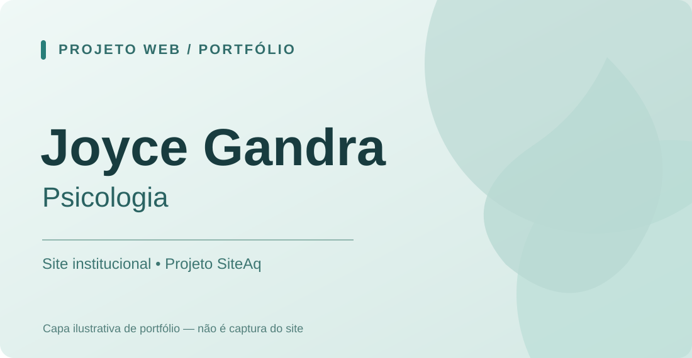

# Joyce Gandra | Psicologia

**Site institucional · Projeto SiteAq**

[**Acessar site publicado ↗**](https://psijoycegandra.com.br/) · [**Perfil do desenvolvedor**](https://github.com/GabrielDeMariaOliveira)

## O projeto

Desenvolvimento de um site institucional para a psicóloga **Joyce Gandra**. Trabalho entregue no contexto da **SiteAq**, com foco na apresentação digital da profissional.

## Participação

- **Gabriel De Maria Oliveira:** desenvolvimento técnico integral.
- **Sócio da SiteAq:** relacionamento comercial, atendimento à cliente e participação na estruturação inicial da ideia.

## Ficha rápida

| Área | Informação |
| --- | --- |
| Segmento | Psicologia |
| Entrega | Site institucional concluído |
| Desenvolvedor | Gabriel De Maria Oliveira |
| Empresa | SiteAq |
| Site publicado | [psijoycegandra.com.br](https://psijoycegandra.com.br/) |

## Documentação técnica

A stack e os detalhes de implementação serão incluídos após validação. Capturas reais de desktop e mobile também dependem de autorização para divulgação.

> **Portfólio sem código-fonte:** este repositório apresenta o projeto profissional. Código, credenciais, integrações e arquivos internos permanecem privados.

---

[**Voltar ao perfil**](https://github.com/GabrielDeMariaOliveira) · [**LinkedIn**](https://www.linkedin.com/in/gabriel-de-maria-oliveira/)

A imagem de capa é uma ilustração de portfólio, não uma captura do site.

